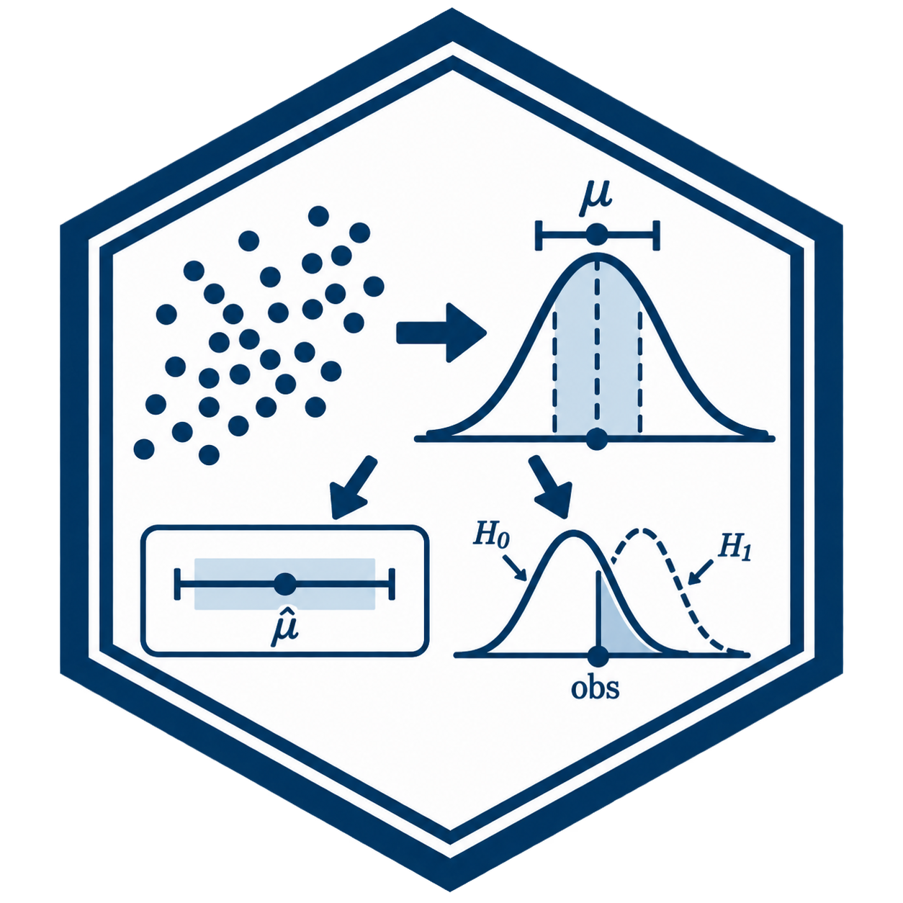
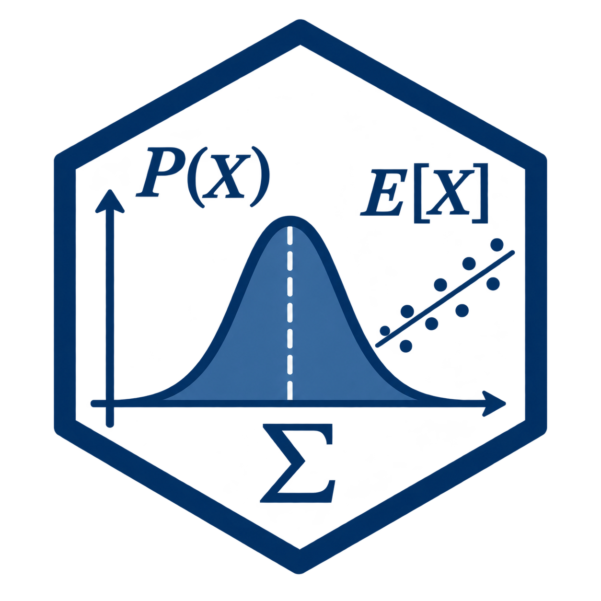

Welcome! I teach statistics and probability at the University of Nebraska–Lincoln, with an emphasis on applications, computation, and statistical thinking. My current courses are provided below for my students and anyone else interested in learning statistics.

## Current Courses

::: {.grid}

::: {.g-col-4}

::: {.card .text-center}

{width=150 fig-align="center" .mt-3}

::: {.card-body}

[STAT 218](https://staturn-courses.github.io/stat-218)

Introduction to Statistics

:::

:::

:::

::: {.g-col-4}

::: {.card .text-center}

{width=150 fig-align="center" .mt-3}

::: {.card-body}

[STAT 380](https://staturn-courses.github.io/stat-380)

Statistics and Applications

:::

:::

:::

::: {.g-col-4}

::: {.card .text-center}

{width=150 fig-align="center" .mt-3}

::: {.card-body}

[STAT 801A](https://staturn-courses.github.io/stat-801a)

Statistical Methods in Research

:::

:::

:::

:::
